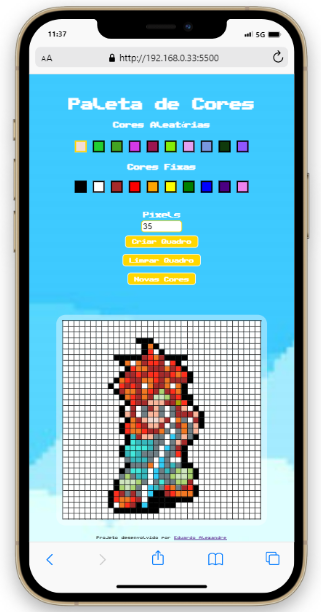
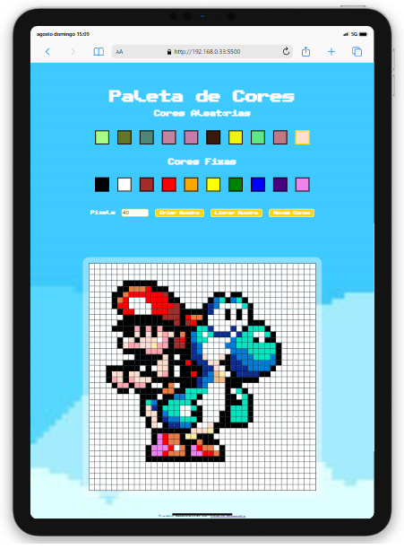
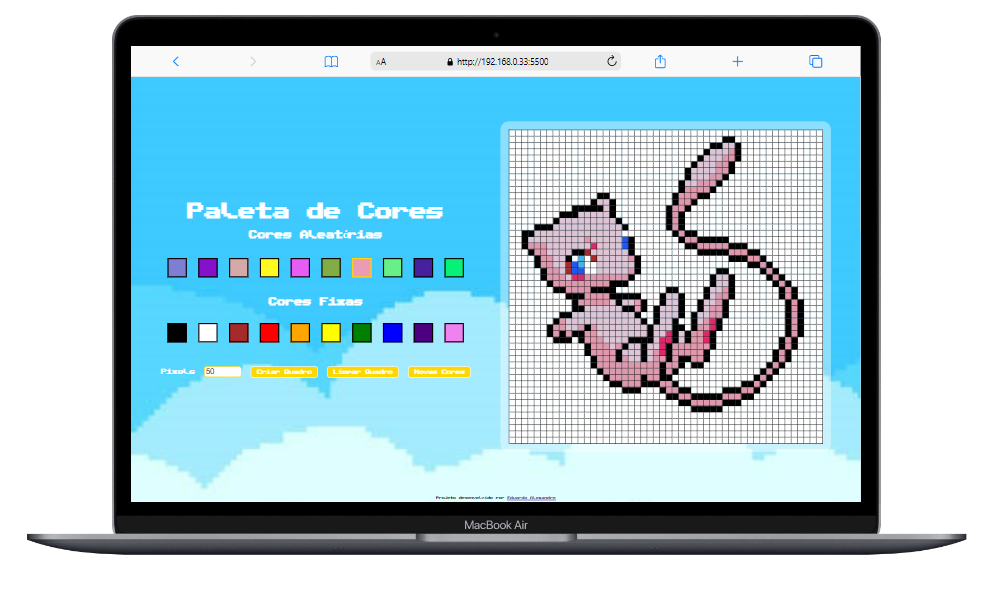

<a id='ancora'></a>
# Projeto Pixel Art - Trybe - Turma 23 A 🚀

<br><br>

- [Sobre a Trybe](#ancora1) <br>
- [Sobre o Projeto](#ancora3) <br>
- [Competências Desenvolvidas](#ancora4) <br>
- [Entregável](#ancora5) <br>
- [Entregável (Opcionais)](#ancora6) <br>
- [Execução](#ancora7) <br>
- [Prints de Execução](#ancora8) <br>
- [Colaboradores](#ancora9)

<br><br>


<a id="ancora1"></a>
## Sobre a Trybe 🏫

<br>
Uuma escola de desenvolvimento web que tem comprometimento genuíno com o sucesso profissional de quem estuda conosco. Com o Modelo de Sucesso Compartilhado (MSC) ofertado pela Trybe Fintech, instituição financeira autorizada a operar pelo Banco Central do Brasil, a pessoa estudante tem a opção de pagar apenas quando já estiver trabalhando.

<br>


<a id="ancora3"></a>
## Sobre o Projeto ✔️

<br>

Projeto consiste na criação de uma paleta de cores aleatórias e pré-determinadas, e que através dessas cores possamos pintar um quadro de pixels de tamanho adaptável.

<br>

<a id="ancora4"></a>
## Competências Desenvolvidas 📝

<br>

* HTML;
* CSS;
* JavaScript;
* Manipulação de DOM e seus elementos;
* Media Queries.

<br>

<a id="ancora5"></a>
## Entregável 📋

<br>

1. Criar uma paleta com cores aleatórias, que mudam ao recarregar a página. ✔️
<br><br>
2. Criar um quadro de pixels que varia de tamanho. ✔️
<br><br>
3. Criar campo de input que receberá o número de pixeis (ao quadrado) que irá compor o quadro. ✔️
<br><br>
4. Criar um botão para iniciar o quadro. ✔️
5. Fazer a responsividade da página. ✔️

<br>

<a id="ancora6"></a>
## Entregável (Opcionais)

<br>

5. Criar um botão para limpar o quadro. ✔️
<br><br>
6. Criar um botão para mudar as cores aleatórias. ✔️

<br>

<a id="ancora7"></a>
## Execução 💻

<br>

Clone este repositório remoto em seu equipamento:
```
git clone git@github.com:DuAlexandre/pixel-art-t23-trybe.git
```
Ou utilize o GitHub Pages para visualizar a página:
```
https://dualexandre.github.io/pixel-art-t23-trybe/
```

<br>

<a id="ancora8"></a>
## Prints de execução 📷

<br>

<center></center>

<br>

<center></center>

<br>

<center></center>

<br><br>

<a id="ancora9"></a>
## 🤝 Colaboradores

Projeto desenvolvido por:

<table>
  <tr>
    <td align="center">
      <a href="https://www.linkedin.com/in/eduardo-alexandre025/">
        <br>
        <sub>
          <b>Eduardo Alexandre</b>
        </sub>
      </a>
  </tr>
</table>

<br><br>

[Voltar ao Topo](#ancora)